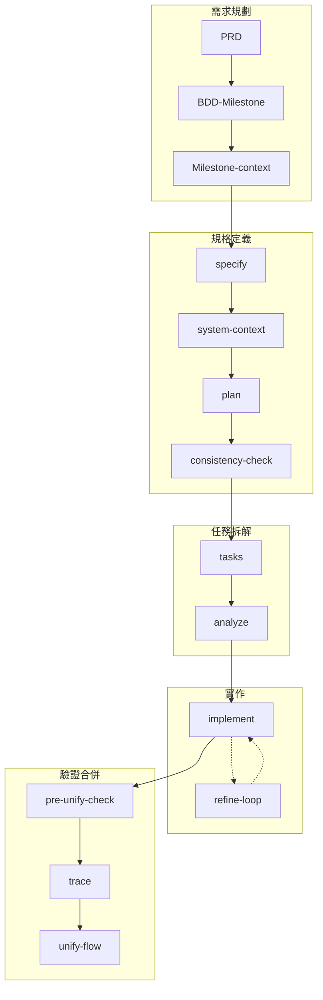

# SpecKit 自定義版本差異說明

> **版本**：v1.0.0  
> **最後更新**：2026-01-31  
> **適用對象**：開發人員、AI Agent  
> **參考原版**：[github/spec-kit](https://github.com/github/spec-kit)

---

## 目錄

1. [總覽](#1-總覽)
2. [核心設計理念差異](#2-核心設計理念差異)
3. [憲法（Constitution）改版](#3-憲法constitution改版)
4. [指令化檔案差異](#4-指令化檔案差異)
5. [模板差異](#5-模板差異)
6. [新增 FlowKit 套件](#6-新增-flowkit-套件)
7. [目錄結構差異](#7-目錄結構差異)
8. [快速對照表](#8-快速對照表)

---

## 1. 總覽

本專案基於 GitHub 官方的 [Spec Kit](https://github.com/github/spec-kit) 進行自定義改版，主要目標是：

| 改版目標 | 說明 |
|----------|------|
| **簡化憲法** | 原版憲法為空白模板，需每次填寫；自定義版本預先定義專案準則 |
| **憲法注入機制** | 透過 Template 約束輸出格式，而非每次動態載入完整憲法 |
| **補足上下文不足** | 新增 `flowkit.system-context`、`flowkit.Milestone-context` 等指令 |
| **全域一致性檢查** | 新增 `flowkit.consistency-check`、`flowkit.pre-unify-check` |
| **追溯性支援** | 新增 `flowkit.trace`、`@spec` 註解機制 |
| **本地化** | 繁體中文為主，關鍵字維持英文 |

### SpecKit vs FlowKit 職責劃分

```
┌─────────────────────────────────────────────────────────┐
│                    開發流程套件                           │
├───────────────────────┬─────────────────────────────────┤
│      SpecKit          │           FlowKit               │
│   （規格定義）         │        （流程輔助）              │
├───────────────────────┼─────────────────────────────────┤
│ • specify             │ • BDD-Milestone                 │
│ • clarify             │ • Milestone-context             │
│ • plan                │ • system-context                │
│ • tasks               │ • consistency-check             │
│ • analyze             │ • pre-unify-check               │
│ • implement           │ • trace                         │
│ • constitution        │ • unify-flow                    │
│ • checklist           │ • refine-loop                   │
│                       │ • requirement-sync              │
├───────────────────────┴─────────────────────────────────┤
│ 定義「做什麼」         │ 確保「做對」                      │
└─────────────────────────────────────────────────────────┘
```

---

## 2. 核心設計理念差異

### 2.1 原版 SpecKit 設計


**原版特點**：
- 憲法為空白模板，每個專案需自行填寫
- 流程線性，缺乏上下文傳遞機制
- 無 System Level 概念，所有 Feature 平行存放
- 無追溯性機制

### 2.2 自定義版本設計



**自定義版本特點**：
- 憲法預先定義，透過 Template 注入約束
- 增加 System / Feature / History 三層架構
- 上下文顯式傳遞（Milestone-context、system-context）
- 全域一致性檢查（consistency-check、pre-unify-check）
- 追溯性支援（@spec 註解、trace 索引）

---

## 3. 憲法（Constitution）改版

### 3.1 原版憲法結構

原版位置：`/memory/constitution.md`

```markdown
# [PROJECT_NAME] Constitution

## Core Principles

### [PRINCIPLE_1_NAME]
[PRINCIPLE_1_DESCRIPTION]

### [PRINCIPLE_2_NAME]
[PRINCIPLE_2_DESCRIPTION]

## Governance
[GOVERNANCE_RULES]

**Version**: [CONSTITUTION_VERSION] | **Ratified**: [RATIFICATION_DATE]
```

**原版特點**：
- 完全空白模板，所有 `[PLACEHOLDER]` 需使用者填寫
- 每次執行 `/speckit.constitution` 都需要輸入完整原則
- 憲法直接被 plan、analyze 等指令載入

### 3.2 自定義版本憲法結構

自定義版本位置：`.specify/memory/constitution.md`

```markdown
# Project Constitution（簡化版）
## SpecKit Plan / Analyze 階段專用

> **版本**：v1.0.0
> **文件性質**：SpecKit 流程中 Plan 填寫與 Analyze 檢驗的核心準則

# Part I: SDD 核心架構

## §1.1 Specification-Driven Development 🔴 NON-NEGOTIABLE
## §1.2 目錄結構（強制）🔴 NON-NEGOTIABLE

# Part II: 開發紀律

## §3.1 TDD/BDD 開發紀律 🔴 NON-NEGOTIABLE
## §3.2 Observability 規範 🔴 NON-NEGOTIABLE

...
```

**自定義版本特點**：
- **預先定義**：已填入專案適用的核心準則
- **分類清晰**：分為 NON-NEGOTIABLE (🔴) 和條件性 (🟡) 兩類
- **檢查清單化**：每條原則都有可驗證的檢查項目
- **模板注入**：透過 `plan-template.md` 的「Constitution Compliance Check」區塊注入

### 3.3 憲法注入機制

**原版機制**：
```
constitution.md ──直接載入──► plan.md / analyze.md
```

**自定義版本機制**：
```
constitution.md
      │
      ├──► spec-template.md     （User Story / AC 格式約束）
      │
      ├──► plan-template.md     （Constitution Compliance Check 區塊）
      │         └── §1.1 SDD 方法論 → 檢查項 ⬜
      │         └── §1.2 目錄結構 → 檢查項 ⬜
      │         └── §3.1 TDD/BDD → 檢查項 ⬜
      │
      └──► tasks-template.md    （任務格式、@spec 註解規則）
```

**優點**：
1. 減少 Token 使用量（不需每次載入完整憲法）
2. 確保遵從性（Template 強制填寫檢查項）
3. 可審計（Plan 中有明確的通過/未通過記錄）

---

## 4. 指令化檔案差異

### 4.1 檔案位置差異

| 項目 | 原版路徑 | 自定義版本路徑 |
|------|----------|----------------|
| 指令檔 | `templates/commands/*.md` | `.github/agents/*.agent.md` |
| 模板 | `templates/*.md` | `.specify/templates/*.md` |
| 憲法 | `memory/constitution.md` | `.specify/memory/constitution.md` |
| 腳本 | `scripts/bash/*.sh`、`scripts/powershell/*.ps1` | `.specify/scripts/powershell/*.ps1` |

### 4.2 speckit.constitution 差異

| 差異項 | 原版 | 自定義版本 |
|--------|------|-----------|
| 憲法路徑 | `/memory/constitution.md` | `.specify/memory/constitution.md` |
| 模板路徑 | `/templates/*.md` | `.specify/templates/*.md` |
| Sync Report | 嵌入憲法檔案頂部（HTML 註解） | 獨立檔案 `.specify/templates/constitution-sync-report.md` |
| Git Checkpoint | ❌ 無 | ✅ 自動 commit + push |

### 4.3 speckit.specify 差異

| 差異項 | 原版 | 自定義版本 |
|--------|------|-----------|
| Milestone 偵測 | ❌ 無 | ✅ 從描述偵測 `MNN-*.md` 並載入 context |
| UI Context | ❌ 無 | ✅ 載入 `specs/system/ui/` 相關文件 |
| UI Impact 評估 | ❌ 無 | ✅ 評估 None/Low/High |
| UI Maturity Target | ❌ 無 | ✅ 設定 L0/L1 目標 |
| YAML Frontmatter | ❌ 無 | ✅ 含 `milestone`、`system_context` 欄位 |
| Handoffs | Build Technical Plan | Build Technical Plan、**Generate System Context**、Clarify Spec |
| 腳本路徑 | `scripts/bash/create-new-feature.sh` | `.specify/scripts/powershell/create-new-feature.ps1` |

**新增的 spec-template.md YAML Frontmatter**：
```yaml
---
milestone: null        # Milestone 編號（如 M01）
system_context: false  # 是否已執行 system-context
created: {DATE}
updated: {DATE}
---
```

### 4.4 speckit.plan 差異

| 差異項 | 原版 | 自定義版本 |
|--------|------|-----------|
| Milestone Context | ❌ 無 | ✅ 讀取 `docs/requirements/Milestone/{milestone}-context.md` |
| System Context | ❌ 無 | ✅ 條件載入 `.flowkit/memory/system-context-index.md` |
| UI/UX Plan | ❌ 無 | ✅ 新增 Section 2（UI Discovery Tasks、受影響畫面、UI 文件更新任務） |
| Constitution Check | 動態從憲法載入 | 預定義固定清單於 `plan-template.md` |
| Handoffs | Create Tasks、Create Checklist | Create Tasks、**確認 plan 與 system 一致性**、Create Checklist |
| Git Checkpoint | ❌ 無 | ✅ Phase 0/1 完成後自動 commit |

**新增的 plan-template.md Section 2（UI/UX Plan）**：
```markdown
## 2. UI/UX Plan

### 2.1 UI Impact Summary
### 2.2 UI Discovery Tasks
### 2.3 受影響畫面
### 2.4 新增 Pattern/State
### 2.5 UI 文件更新任務
```

### 4.5 speckit.tasks 差異

| 差異項 | 原版 | 自定義版本 |
|--------|------|-----------|
| 測試要求 | 預設產生測試任務 | ⚠️ 測試為 **Optional**，僅在明確要求時產生 |
| User Story 標籤 | `[US1]` 用於組織 | `[US1]` 同時用於 **Traceability**（@spec 註解） |
| Traceability 說明 | ❌ 無 | ✅ 說明標籤用於追溯索引、覆蓋率計算 |
| Git Checkpoint | ❌ 無 | ✅ 任務產生後自動 commit |

**tasks-template.md 新增的 Traceability 說明**：
```markdown
## User Story 標籤用途（Traceability）

| 用途 | 說明 |
|------|------|
| **可追溯性索引** | 自動建立 Spec → Code 對應關係 |
| **覆蓋率計算** | 確保每個 User Story 都有實作 |
| **@spec 註解** | implement 時自動在程式碼加入 @spec 註解 |
```

### 4.6 speckit.analyze 差異

| 差異項 | 原版 | 自定義版本 |
|--------|------|-----------|
| UI Consistency | ❌ 無 | ✅ 新增 G Channel（UI ID 驗證、TBD 解析、Maturity Gate） |
| Git Checkpoint | ❌ 無 | ✅ 修正後自動 commit |

**新增的 G Channel（UI Consistency）**：
| Check | Description | Severity |
|-------|-------------|----------|
| G1 | UI ID 存在性驗證 | HIGH |
| G2 | `[UI-TBD]` 解析狀態 | MEDIUM |
| G3 | State Coverage | MEDIUM |
| G4 | Confirmation Rules | MEDIUM |
| G5 | Maturity Gate (L1) | HIGH |
| G6 | `[NEEDS UI DEFINITION]` 解析 | HIGH |

### 4.7 speckit.implement 差異

| 差異項 | 原版 | 自定義版本 |
|--------|------|-----------|
| Checklist 檢查 | ❌ 無 | ✅ 掃描 `checklists/` 目錄，未完成則詢問是否繼續 |
| UI Gate Check | ❌ 無 | ✅ 驗證 UI ID 存在性、L1 Maturity、TBD 解析 |
| @spec 註解 | ❌ 無 | ✅ 建立檔案時自動加入追溯註解 |
| Git Checkpoint | ❌ 無 | ✅ 每 Phase 完成後自動 commit |
| Handoffs | ❌ 無 | ✅ 建立追溯索引（flowkit.trace）、Debug/微調（flowkit.refine-loop） |

**@spec 註解格式**：
```python
# @spec US1 (NNN-feature-name/spec.md#user-story-1)
# @spec-ac AC1.1, AC1.2

class MyClass:
    pass
```

---

## 5. 模板差異

### 5.1 spec-template.md 差異

| 差異項 | 原版 | 自定義版本 |
|--------|------|-----------|
| YAML Frontmatter | ❌ 無 | ✅ `milestone`、`system_context`、`created`、`updated` |
| User Story 格式 | 無固定格式 | ✅ BDD 標準格式（As a / I want / So that） |
| AC 格式 | 無固定格式 | ✅ Given/When/Then 格式 |
| 語言 | 英文 | 繁體中文（含 placeholder） |

### 5.2 plan-template.md 差異

| 差異項 | 原版 | 自定義版本 |
|--------|------|-----------|
| UI/UX Plan 區塊 | ❌ 無 | ✅ Section 2 完整 UI 規劃區塊 |
| Constitution Check | 動態（從憲法載入） | 固定清單（已定義於模板） |
| 語言 | 英文 | 繁體中文 |

**原版 Constitution Check**：
```markdown
## Constitution Check

*GATE: Must pass before Phase 0 research.*

[Gates determined based on constitution file]
```

**自定義版本 Constitution Compliance Check**：
```markdown
## 3. Constitution Compliance Check

### 3.1 NON-NEGOTIABLE Requirements (🔴)

| 條款 | 要求 | 本計畫對應 | 狀態 |
|------|------|------------|------|
| §1.1 | SDD 方法論 | | ⬜ |
| §1.2 | 目錄結構 | | ⬜ |
| §3.1 | TDD/BDD Flow | | ⬜ |
| §3.2 | Observability | | ⬜ |
```

### 5.3 tasks-template.md 差異

| 差異項 | 原版 | 自定義版本 |
|--------|------|-----------|
| 測試產物提示 | ❌ 無 | ✅ 提醒設定 `.artifacts/` 輸出 |
| Traceability 說明 | ❌ 無 | ✅ 說明 `[US*]` 標籤用途 |
| 語言 | 英文 | 繁體中文 |

---

## 6. 新增 FlowKit 套件

FlowKit 是為補足原版 SpecKit 不足之處而新增的流程輔助套件。

### 6.1 FlowKit 指令一覽

| 指令 | 執行時機 | 目的 |
|------|----------|------|
| `BDD-Milestone` | 需求規劃階段 | PRD → User Stories → Milestone |
| `Milestone-context` | BDD-Milestone 後 | 抽取 PRD 設計上下文、衝突檢測 |
| `system-context` | Plan 前 | 建立專案已實作部分的上下文 |
| `consistency-check` | Plan 後 | 檢查覆用、不重做、整合建議 |
| `pre-unify-check` | Implement 後 | 實作驗證，確認可合併 |
| `trace` | Implement 後 | 建立 Spec-Code 追溯索引 |
| `requirement-sync` | Unify 前 | 回寫變更至 PRD/User Stories |
| `unify-flow` | 驗證通過後 | 合併 Feature 至 System Spec |
| `refine-loop` | Implement 中 | 小幅修正的縮小版 SpecKit |

### 6.2 FlowKit 解決的問題

| 問題 | 原版狀況 | FlowKit 解決方案 |
|------|----------|------------------|
| **上下文不足** | Plan 階段不知道現有系統狀況 | `system-context` 提供已實作功能清單 |
| **無衝突檢測** | 可能重做現有功能 | `consistency-check` 檢查覆用可能性 |
| **無追溯性** | 無法追蹤 Spec → Code 對應 | `trace` + `@spec` 註解建立追溯索引 |
| **無合併流程** | Feature 完成後無整合機制 | `unify-flow` 合併至 System Spec |
| **無需求同步** | 開發變更不回寫需求文件 | `requirement-sync` 同步 PRD/US |

詳細說明請參考：[FlowKit 功能說明文件](../77.flowkit相關文件/README.md)

### 6.3 `--default` 半自動化模式 🚀

自定義版本新增 **`--default` 模式**，實現半自動化開發流程：

**原版 vs 自定義版本**：

| 操作 | 原版 | 自定義版本（`--default` 模式） |
|------|------|------------------------------|
| 觸發指令 | 需輸入完整參數 | `--default` 自動載入預設 |
| Milestone 選擇 | ❌ 不支援 | ✅ 自動偵測最新 Milestone |
| 上下文載入 | 手動指定 | ✅ 自動載入相關 context |
| 流程串接 | 逐步手動呼叫 | ✅ 逐階段推進，僅需確認意圖 |

**特殊 Smart Defaults**：

| 指令 | `--default` 行為 |
|------|-----------------|
| `speckit.specify --default` | 自動偵測 `docs/requirements/Milestone/` 中編號最高的 `MNN-*.md`（排除 `*-context.md`）作為 Feature 描述來源 |
| `flowkit.Milestone-context --default` | 自動選擇編號最高的 Milestone，產生開發上下文 |

**半自動化流程架構**：

```
開發者                    AI（--default 模式）
  │                              │
  ├─ /specify --default ─────────►│ 偵測最新 MNN → 產生 spec.md
  │                              │
  │◄─────── 審閱 spec ◄──────────┤
  │                              │
  ├─ 確認 → /plan --default ────►│ 載入 context → 產生 plan.md
  │                              │
  │◄─────── 審閱 plan ◄──────────┤
  │                              │
  └─ 確認 → 下一階段 ───────────►│ ...
```

**核心價值**：開發者只需「審閱並確認意圖」，AI 自動處理上下文載入與流程串接。

📖 **詳細說明**：[功能說明-default-mode.md](../77.flowkit相關文件/功能說明-default-mode.md)

---

## 7. 目錄結構差異

### 7.1 原版目錄結構

```
project-root/
├── memory/
│   └── constitution.md
├── specs/
│   └── NNN-feature-name/
│       ├── spec.md
│       ├── plan.md
│       └── tasks.md
├── templates/
│   ├── spec-template.md
│   ├── plan-template.md
│   └── tasks-template.md
└── scripts/
    ├── bash/
    └── powershell/
```

### 7.2 自定義版本目錄結構

```
project-root/
├── .specify/                      # Spec Kit 內部資料
│   ├── memory/
│   │   └── constitution.md
│   ├── templates/
│   │   ├── spec-template.md
│   │   ├── plan-template.md
│   │   └── tasks-template.md
│   └── scripts/
│       └── powershell/
├── .flowkit/                      # FlowKit 內部資料
│   ├── memory/
│   │   ├── system-context.md
│   │   └── system-context-index.md
│   └── templates/
├── .github/agents/                # Agent 指令檔
│   ├── speckit.*.agent.md
│   └── flowkit.*.agent.md
├── specs/
│   ├── system/                    # 🔴 System Level（唯一真相）
│   │   ├── spec.md
│   │   ├── data-model.md
│   │   ├── flows.md
│   │   ├── ui/
│   │   └── contracts/
│   ├── features/                  # 🟡 Feature Level（開發中）
│   │   └── NNN-feature-name/
│   └── history/                   # 🟤 History（封存）
├── docs/
│   └── requirements/
│       ├── Milestone/
│       └── user-stories/
└── src/
```

### 7.3 關鍵差異

| 差異項 | 原版 | 自定義版本 |
|--------|------|-----------|
| 套件資料位置 | 根目錄分散 | `.specify/`、`.flowkit/` 集中 |
| 規格層級 | 單一層（features 並列） | 三層（system/features/history） |
| UI 規格 | ❌ 無 | ✅ `specs/system/ui/` |
| 需求文件 | ❌ 無 | ✅ `docs/requirements/` |

---

## 8. 快速對照表

### 8.1 指令對照

| 原版指令 | 自定義版本 | 備註 |
|----------|-----------|------|
| `/speckit.constitution` | `/speckit.constitution` | 路徑改為 `.specify/memory/` |
| `/speckit.specify` | `/speckit.specify` | 新增 Milestone、UI Context 支援 |
| `/speckit.clarify` | `/speckit.clarify` | 基本相同 |
| `/speckit.plan` | `/speckit.plan` | 新增 System Context、UI Plan |
| `/speckit.tasks` | `/speckit.tasks` | 測試改為 Optional |
| `/speckit.analyze` | `/speckit.analyze` | 新增 UI Consistency Channel |
| `/speckit.implement` | `/speckit.implement` | 新增 UI Gate、@spec 註解 |
| `/speckit.checklist` | `/speckit.checklist` | 基本相同 |
| ❌ 無 | `/flowkit.BDD-Milestone` | **新增** |
| ❌ 無 | `/flowkit.Milestone-context` | **新增** |
| ❌ 無 | `/flowkit.system-context` | **新增** |
| ❌ 無 | `/flowkit.consistency-check` | **新增** |
| ❌ 無 | `/flowkit.pre-unify-check` | **新增** |
| ❌ 無 | `/flowkit.trace` | **新增** |
| ❌ 無 | `/flowkit.unify-flow` | **新增** |
| ❌ 無 | `/flowkit.refine-loop` | **新增** |
| ❌ 無 | `/flowkit.requirement-sync` | **新增** |

### 8.2 檔案路徑對照

| 項目 | 原版路徑 | 自定義版本路徑 |
|------|----------|----------------|
| 憲法 | `/memory/constitution.md` | `.specify/memory/constitution.md` |
| 規格模板 | `/templates/spec-template.md` | `.specify/templates/spec-template.md` |
| 計畫模板 | `/templates/plan-template.md` | `.specify/templates/plan-template.md` |
| 任務模板 | `/templates/tasks-template.md` | `.specify/templates/tasks-template.md` |
| 指令檔 | `/templates/commands/*.md` | `.github/agents/*.agent.md` |
| System Spec | ❌ 無 | `specs/system/spec.md` |
| UI 規格 | ❌ 無 | `specs/system/ui/` |
| System Context | ❌ 無 | `.flowkit/memory/system-context.md` |

### 8.3 功能支援對照

| 功能 | 原版 | 自定義版本 |
|------|:----:|:----------:|
| SDD 基本流程 | ✅ | ✅ |
| 憲法管理 | ✅ | ✅ |
| 規格定義 | ✅ | ✅ |
| 技術計畫 | ✅ | ✅ |
| 任務拆解 | ✅ | ✅ |
| 一致性分析 | ✅ | ✅ |
| 實作執行 | ✅ | ✅ |
| Milestone 管理 | ❌ | ✅ |
| System Context | ❌ | ✅ |
| UI/UX 規格 | ❌ | ✅ |
| UI Maturity Gate | ❌ | ✅ |
| 追溯性（@spec） | ❌ | ✅ |
| 覆用檢查 | ❌ | ✅ |
| Pre-Unify 驗證 | ❌ | ✅ |
| Unify Flow | ❌ | ✅ |
| 需求同步 | ❌ | ✅ |
| Git Checkpoint | ❌ | ✅ |

---

## 附錄：相關文件

| 文件 | 位置 | 說明 |
|------|------|------|
| FlowKit README | [docs/77.flowkit相關文件/README.md](../77.flowkit相關文件/README.md) | FlowKit 功能說明總覽 |
| SDD 開發流程圖 | [docs/77.flowkit相關文件/SDD開發流程圖.md](../77.flowkit相關文件/SDD開發流程圖.md) | 完整流程 Mermaid 圖 |
| 憲法 | [.specify/memory/constitution.md](../../.specify/memory/constitution.md) | 專案準則 |
| Copilot Instructions | [.github/copilot-instructions.md](../../.github/copilot-instructions.md) | AI 行為準則 |

---

**版本歷史**：
- v1.0.0 (2026-01-31)：初版建立
