# SDD 開發流程圖

> **最後更新**：2026-01-26  
> **用途**：SpecKit + FlowKit 整體開發流程視覺化（Mermaid 版本）

---

## 流程總覽表

| 階段 | 步驟 | 指令 | 輸入 | 輸出 | 備註 |
|------|------|------|------|------|------|
| **需求規劃** | 1a | `flowkit.BDD-Milestone` | PRD | User Stories | 🟡 僅首次 / PRD 變更時 |
| | 1b | `flowkit.BDD-Milestone` | User Stories | Milestone | 每次 Feature 開發 |
| | 2 | `flowkit.Milestone-context` | PRD, Milestone, System | 設計上下文, 衝突報告 | 抽取相關內容 + 衝突檢測 |
| **規格定義** | 3 | `speckit.specify` | Milestone | Feature Spec, 新分支 | 建立 Feature 規格 |
| | 4 | `speckit.clarify` | Spec | 釐清後 Spec | 🟡 選擇性 |
| | 5 | `flowkit.system-context` | System | 已實作上下文 | **建議必要**（除非首個 Feature） |
| | 6 | `speckit.plan` | Spec, 上下文 | Plan | 制定實作計畫 |
| | 7 | `flowkit.consistency-check` | Plan, System | 檢查報告 | 確認覆用、不重做、整合建議 |
| **任務拆解** | 8a | `speckit.tasks` | Plan | Tasks | 拆解可驗收任務 |
| | 8b | `speckit.analyze` | Tasks, 程式碼 | 分析報告 | 確認 Feature 內一致性 |
| **實作** | 9 | `speckit.implement` | Tasks | 程式碼, 測試 | 實作程式碼 |
| | 9' | `flowkit.refine-loop` | 修正需求 | 更新 Spec/Code | 🔄 循環：需要時使用 |
| **驗證合併** | 10a | `flowkit.pre-unify-check` | 實作結果 | 檢查報告 | 確認可安全合併 |
| | 10b | `flowkit.trace` | Spec, Code | 追溯索引 | 建立規格-程式碼對照 |
| | 10c | `flowkit.requirement-sync` | Feature, PRD, US | 更新需求文件 | 回寫變更至 PRD / User Stories |
| | 11 | `flowkit.unify-flow` | Feature | System 更新 | 合併至 System Spec |

---

## 完整開發流程圖

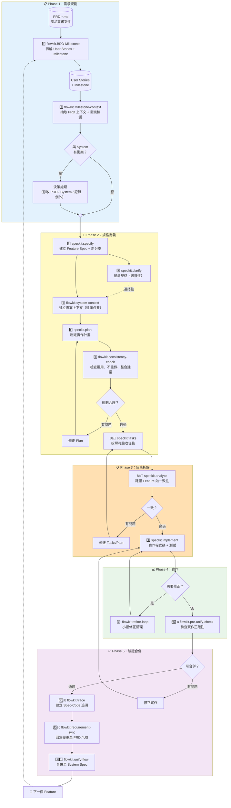

---

## 簡化線性流程（快速參考）

```mermaid
flowchart LR
    subgraph 輸入["📘 輸入"]
        PRD["PRD-*.md"]
    end
    
    subgraph 需求["📋 需求規劃"]
        A1["🟡 BDD-Milestone<br/>PRD → US"] --> A2["BDD-Milestone<br/>US → Milestone"]
        A2 --> B["Milestone-context"]
    end
    
    subgraph 規格["📝 規格定義"]
        C["specify"] --> C2["clarify<br/>（選擇性）"]
        C2 --> D["system-context<br/>（建議必要）"]
        D --> E["plan"]
        E --> F["consistency-check"]
    end
    
    subgraph 任務["📝 任務拆解"]
        G["tasks"] --> H["analyze"]
    end
    
    subgraph 實作["💻 實作"]
        I["implement"] -.-> I2["refine-loop"]
        I2 -.-> I
    end
    
    subgraph 驗證["✅ 驗證合併"]
        J["pre-unify-check"] --> J2["trace"]
        J2 --> K["requirement-sync"]
        K --> L["unify-flow"]
    end
    
    PRD --> A1
    B --> C
    F --> G
    H --> I
    I --> J
    L -.-> |"Next Feature"| A2
    
    style 輸入 fill:#e8eaf6
    style 需求 fill:#e3f2fd
    style 規格 fill:#fff9c4
    style 任務 fill:#ffe0b2
    style 實作 fill:#e8f5e9
    style 驗證 fill:#f3e5f5
```

> 🟡 **注意**：
> - `BDD-Milestone (PRD → US)` 僅在首次或 PRD 變更時執行，後續 Feature 開發直接從 `BDD-Milestone (US → Milestone)` 開始。
> - `Milestone-context` 固定在 BDD-Milestone 之後執行（spec 和 plan 皆可能需要）。
> - `system-context` **建議**在 specify 之後、plan 之前執行（**建議必要**，除非是第一個 Feature）。

---

## 指令分類視圖

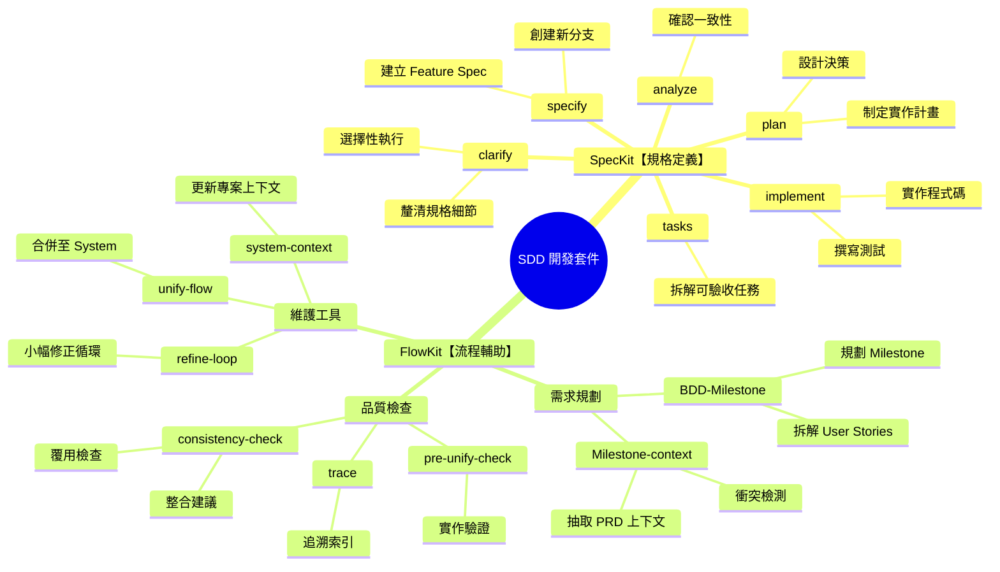

---

## 階段詳解

### Phase 1：需求規劃

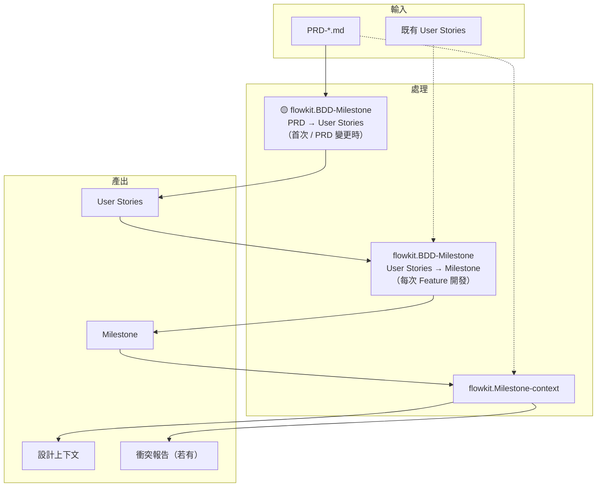

**目的**：將模糊的產品需求轉化為結構化的開發單位

| 指令 | 模式 | 執行時機 | 關鍵產出 |
|------|------|----------|----------|
| `BDD-Milestone` | PRD → US | 🟡 首次 / PRD 變更 | User Stories（BDD 格式）|
| `BDD-Milestone` | US → Milestone | 每次 Feature 開發 | Milestone 規劃 |
| `Milestone-context` | - | Milestone 建立後 | PRD 相關內容、衝突報告 |

---

### Phase 2：規格定義

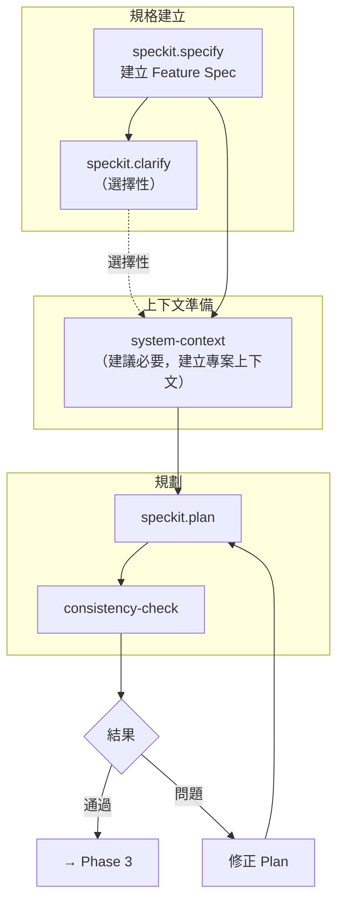

**目的**：定義清晰的規格並制定善用現有系統的實作計畫

| 指令 | 核心任務 | 關鍵產出 |
|------|----------|----------|
| `specify` | 建立規格 | spec.md、新 Feature 分支 |
| `clarify` | 釐清細節 | 更精確的 spec（選擇性） |
| `system-context` | 建立專案上下文 | system-context-index.md（建議必要） |
| `plan` | 制定計畫 | plan.md |
| `consistency-check` | 確認覆用 | 檢查報告（覆用建議、整合建議） |

---

### Phase 3：任務拆解

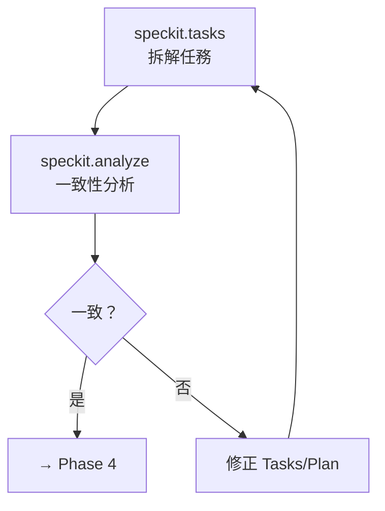

**目的**：將計畫轉化為可執行、可驗收的任務清單

---

### Phase 4：實作

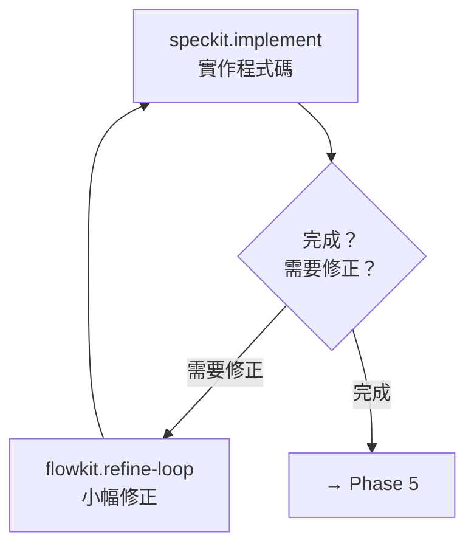

**目的**：按照規格實作程式碼，必要時進行小幅調整

| 指令 | 核心任務 | 使用時機 |
|------|----------|----------|
| `implement` | 實作程式碼 | 主要實作流程 |
| `refine-loop` | 小幅修正 | 發現需要調整規格或程式碼時 |

---

### Phase 5：驗證合併

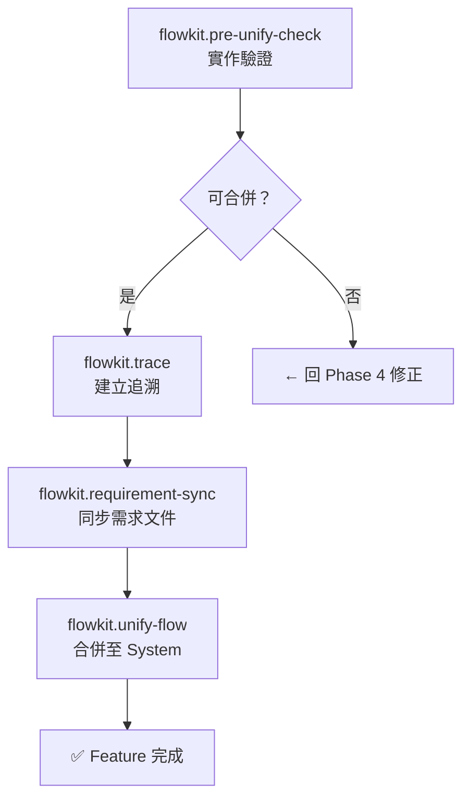

**目的**：確保實作品質、同步需求文件，並將 Feature 整合回 System

| 指令 | 核心任務 | 關鍵產出 |
|------|----------|----------|
| `pre-unify-check` | 實作驗證 | 檢查報告 |
| `trace` | 追溯建立 | Spec-Code 對照索引 |
| `requirement-sync` | 需求同步 | 更新 PRD / User Stories |
| `unify-flow` | 合併 | System Spec 更新 |

---

## 決策點詳解

### Milestone-context 衝突處理

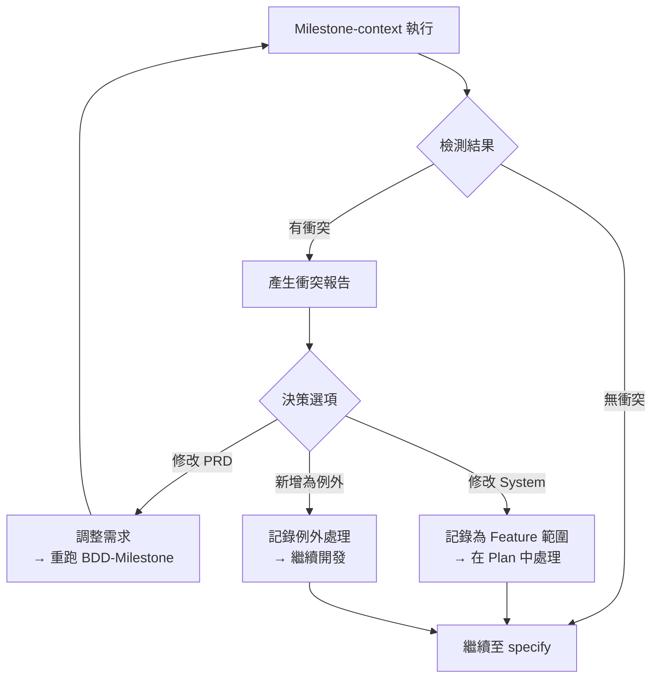

### consistency-check 覆用檢查

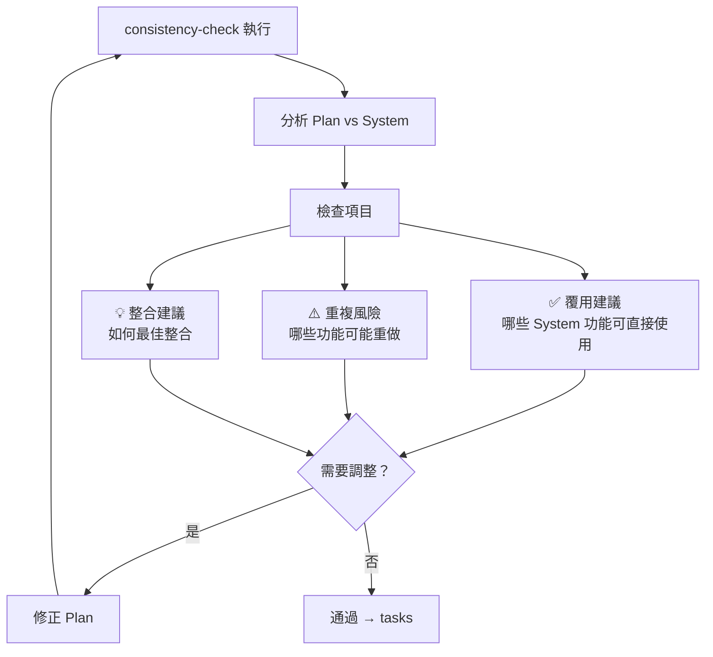

---

## 上下文流動圖

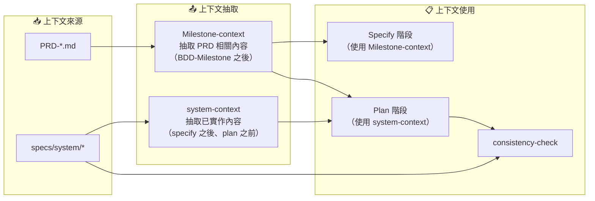

---

## 首個 Feature vs 後續 Feature

| 面向 | 首個 Feature | 後續 Feature |
|------|-------------|--------------|
| `system-context` | 可略過（System 尚空） | 需要（理解已實作功能） |
| `Milestone-context` 衝突檢測 | 通常無衝突 | 需仔細檢查 |
| `consistency-check` | 著重架構建立 | 著重覆用與整合 |
| `pre-unify-check` | 基礎檢查 | 需確認與現有功能相容 |

---

## 使用說明

### 在 VS Code 中預覽

1. 安裝 Markdown Preview Mermaid Support 擴充套件
2. 開啟本文件
3. 按 `Ctrl+Shift+V` 預覽

### 在 GitHub 中檢視

GitHub 原生支援 Mermaid，直接在 Repository 中檢視即可。

### 匯出為圖片

1. 使用 [Mermaid Live Editor](https://mermaid.live/)
2. 貼上 Mermaid 程式碼
3. 下載 PNG/SVG
