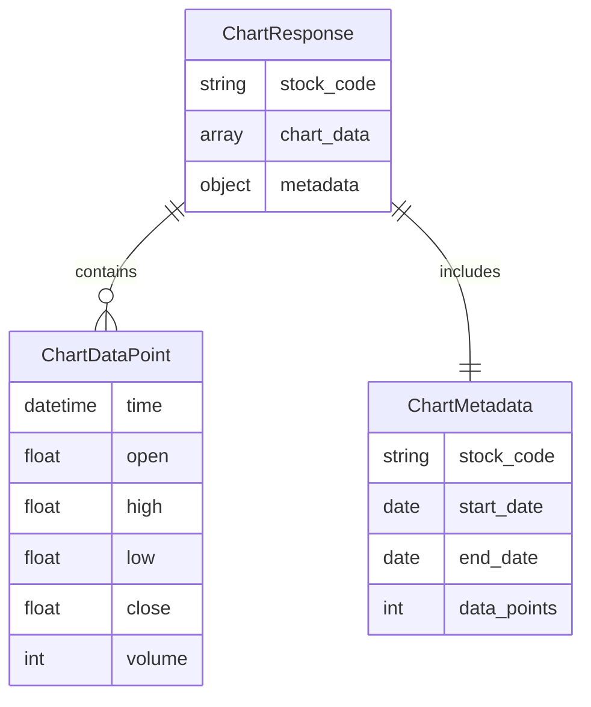

# Data Model: Taiwan Market Time Machine（台股時光機）

> **Version**: 0.2.0  
> **Last Updated**: 2026-02-04

---

## 1. Core Entities

### ChartDataPoint

**用途**：單一時間點的 OHLCV（開高低收量）資料

| 欄位 | 型別 | 必填 | 說明 |
|------|------|------|------|
| `time` | `datetime` | ✅ | 時間點（ISO 8601 格式，含時區） |
| `open` | `float` | ✅ | 開盤價 |
| `high` | `float` | ✅ | 最高價 |
| `low` | `float` | ✅ | 最低價 |
| `close` | `float` | ✅ | 收盤價 |
| `volume` | `int` | ✅ | 成交量 |

#### Validation Rules
- `time` 必須為合法的 datetime 格式
- `high` ≥ `max(open, close)` ≥ `low`
- `low` ≤ `min(open, close)` ≤ `high`
- `volume` ≥ 0

#### Invariants
- 價格欄位（OHLC）必須符合市場邏輯關係

---

### ChartMetadata

**用途**：查詢結果的元資料，提供結果統計資訊

| 欄位 | 型別 | 必填 | 說明 |
|------|------|------|------|
| `stock_code` | `str` | ✅ | 股票代碼（與查詢參數一致） |
| `start_date` | `date` | ✅ | 查詢起始日期 |
| `end_date` | `date` | ✅ | 查詢結束日期 |
| `data_points` | `int` | ✅ | 回傳的資料點數量 |

#### Validation Rules
- `stock_code` 必須為 4 位數字字串
- `start_date` ≤ `end_date`
- `data_points` ≥ 0

---

### ChartResponse

**用途**：API 回應格式，包含圖表資料與元資料

| 欄位 | 型別 | 必填 | 說明 |
|------|------|------|------|
| `stock_code` | `str` | ✅ | 股票代碼 |
| `chart_data` | `List[ChartDataPoint]` | ✅ | OHLCV 資料陣列 |
| `metadata` | `ChartMetadata` | ✅ | 查詢結果元資料 |

#### Validation Rules
- `stock_code` 必須與 `metadata.stock_code` 一致
- `len(chart_data)` 必須等於 `metadata.data_points`

#### Invariants
- 查無資料時，`chart_data` 為空陣列，`metadata.data_points` 為 0

---

### ErrorResponse

**用途**：統一錯誤回應格式

| 欄位 | 型別 | 必填 | 說明 |
|------|------|------|------|
| `code` | `str` | ✅ | 錯誤碼（見 spec.md 錯誤碼規範）|
| `message` | `str` | ✅ | 錯誤訊息摘要 |
| `details` | `str` | ❌ | 詳細錯誤說明（選填）|

#### Validation Rules
- `code` 必須為預定義的錯誤碼（INVALID_STOCK_CODE, INVALID_DATE_RANGE, NO_DATA, DATABASE_ERROR, INTERNAL_ERROR）

---

## 2. Enumerations

### ErrorCode

**用途**：標準錯誤碼列表

| 值 | 說明 |
|----|------|
| `INVALID_STOCK_CODE` | 股票代碼格式錯誤 |
| `INVALID_DATE_RANGE` | 日期範圍不合法 |
| `INVALID_DATE_FORMAT` | 日期格式錯誤 |
| `NO_DATA` | 查無資料（非錯誤狀態，HTTP 200）|
| `DATABASE_ERROR` | 資料庫連線或查詢錯誤 |
| `INTERNAL_ERROR` | 伺服器內部錯誤 |

---

## 3. Relationships

**說明**：
- `ChartResponse` 包含多個 `ChartDataPoint`（1 對多關係）
- `ChartResponse` 包含一個 `ChartMetadata`（1 對 1 關係）

---

## 4. Version History

| 版本 | 日期 | 變更說明 |
|------|------|----------|
| 0.2.0 | 2026-02-04 | 新增核心模型：ChartDataPoint, ChartResponse, ChartMetadata, ErrorResponse 定義 ErrorCode 列舉 新增關聯圖 |
| 0.1.0 | 2026-02-03 | 初始版本（空白範本）|

<!-- 描述實體之間的關係 -->

> 📝 **尚未定義關聯** - 依需要新增

---

## Version History

| 版本 | 日期 | 變更說明 |
|------|------|----------|
| 0.1.0 | YYYY-MM-DD | 初始版本 |
