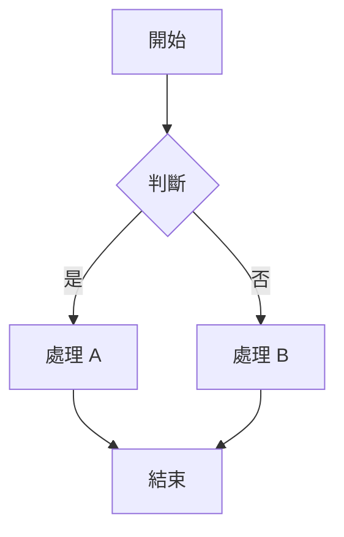

# System Flows: [專案名稱]

> **Version**: 0.1.0  
> **Last Updated**: YYYY-MM-DD

---

## 1. Core Flows

<!-- 
格式範例：

### Flow 1: [流程名稱]

#### 步驟說明
1. Step 1
2. Step 2
3. Step 3

#### 錯誤處理
- 情況 A → 處理方式
-->

> 📝 **尚未定義系統流程** - 請依據專案需求撰寫

---

## 2. Error Handling Flows

<!-- 描述錯誤處理流程 -->

> 📝 **依需要新增**

---

## Version History

| 版本 | 日期 | 變更說明 |
|------|------|----------|
| 0.1.0 | YYYY-MM-DD | 初始版本 |
